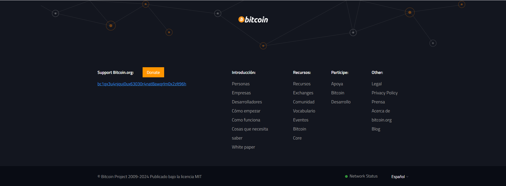

# propuesta  de cambio de imagen

### un header  blanco es util en muchas empresas, aunque muchos tambien optan por heaers oscuros.
```

```
**|**|**


### un footer oscuro es tendencia en la mayoria de paginas de tecnologia
```
Un footer oscuro en un sitio con tema diurno mejora la jerarquía visual y el contraste, ayudando a diferenciar claramente el final del contenido principal. También facilita destacar enlaces importantes sin distracción. La industria lo usa porque crea equilibrio visual, da un toque elegante y profesional, y ofrece una transición visual suave hacia el cierre de la página.
```
*react page*| *bitcoin page*| *imb page*
:---:|:---:|:---|
| |


# diseño de componentes

## material desing

Material Design es una referencia de diseño desarrollada por Google que se destaca por su enfoque en la consistencia visual, la accesibilidad y la experiencia del usuario. Implementar Material Design como base para nuestra web empresarial, sin recurrir a frameworks específicos, nos ofrece varias ventajas:

* Estándar Visual Coherente
* Diseño Responsivo y Adaptable
* Accesibilidad Integrada
* Efectos y Jerarquía Visuales Mejorados
* Escalabilidad y Sostenibilidad

[guia de material desing en figma](https://www.figma.com/community/file/1035203688168086460)

### empresas y marcas que utilizan material desing

1. Dropbox
1. Spotify 
1. Evernote
1. Airbnb
1. Slack 
1. Asana 
1. Pinterest
1. Zomato 
1. odoo
## fluent desing system

[fluent desing](fluent_desing.png)
 Desarrollado por Microsoft, Fluent Design se centra en crear experiencias de usuario coherentes en diferentes plataformas. Se caracteriza por el uso de capas, luz y movimiento para crear una experiencia visual rica.

1. BBC News
2. Adobe
2. Skype
2. LinkedIn
2. Xbox
2. OneNote
2. Microsoft Teams
2. GitHub
2. Slack
2. Zoom
2. Bing


### la identidad de los grande.

# colores
 estas empresas utilizan colores que refuerzan su identidad de marca y la confianza del cliente. El azul es el color predominante en la mayoría de las paletas, reflejando una sensación de seguridad y profesionalismo, mientras que los tonos más vibrantes como el rojo y el verde se utilizan para comunicar innovación y energía. La combinación de colores claros y oscuros también ayuda a crear un contraste visual atractivo, lo que mejora la legibilidad y la accesibilidad de sus marcas.

1. IBM <div style="display:flex"><div style="background-color:#005EB8; width:2rem; height:2rem;"></div><div style="background-color:#ffffff; width:2rem; height:2rem;"></div></div>

* Colores Principales: Azul (#005EB8) y blanco.
> Análisis: El azul es un color asociado con la confianza, la estabilidad y la profesionalidad. IBM utiliza una gama de azules que refuerzan su imagen como líder en tecnología y soluciones empresariales. El blanco proporciona un contraste limpio y moderno, lo que sugiere simplicidad y claridad.
2. Microsoft <div style="display:flex"><div style="background-color:#F25022; width:2rem; height:2rem;"></div><div style="background-color:#7FBA00; width:2rem; height:2rem;"></div><div style="background-color:#00A4EF; width:2rem; height:2rem;"></div><div style="background-color:#FFB900; width:2rem; height:2rem;"></div><div style="background-color:#ffffff; width:2rem; height:2rem;"></div></div>

* Colores Principales: Rojo (#F25022), verde (#7FBA00), azul (#00A4EF), amarillo (#FFB900) y blanco.
> Análisis: Microsoft emplea una paleta vibrante y diversa que refleja innovación y creatividad. Cada color representa diferentes aspectos de sus productos: el rojo simboliza energía, el verde sugiere crecimiento, el azul representa confianza y el amarillo aporta un toque de optimismo. Esta diversidad de colores también indica una amplia gama de servicios.
3. Salesforce <div style="display:flex"><div style="background-color:#00A1E0; width:2rem; height:2rem;"></div><div style="background-color:#ffffff; width:2rem; height:2rem;"></div></div>

* Colores Principales: Azul (#00A1E0) y blanco.
> Análisis: El azul es un color predominante en el sector tecnológico, utilizado por Salesforce para transmitir confianza y seguridad. La combinación con blanco sugiere frescura y accesibilidad, lo que es importante para una empresa centrada en la atención al cliente y la innovación en soluciones de gestión de relaciones con clientes (CRM).
4. Oracle <div style="display:flex"><div style="background-color:#F80000; width:2rem; height:2rem;"></div><div style="background-color:#D7D7D7; width:2rem; height:2rem;"></div></div>

* Colores Principales: Rojo (#F80000) y gris (#D7D7D7).
> Análisis: El rojo de Oracle simboliza fuerza, poder y determinación, lo que subraya su papel como líder en soluciones de bases de datos y software empresarial. Los tonos de gris añaden un sentido de sofisticación y profesionalismo, creando un equilibrio entre audacia y seriedad.
5. SAP <div style="display:flex"><div style="background-color:#004B87; width:2rem; height:2rem;"></div><div style="background-color:#ffffff; width:2rem; height:2rem;"></div></div>

* Colores Principales: Azul (#004B87) y blanco.
> Análisis: Similar a IBM y Salesforce, SAP utiliza el azul para evocar confianza y estabilidad. Este color resuena bien en el contexto empresarial, donde las decisiones críticas se basan en datos y soluciones confiables. El uso de blanco como color complementario aporta claridad y modernidad.


---


### Nosotros como marca.
ya poseemos una identidad tanto como marca-empresa, solo debemos incentivar la presencia. debemos de cambiar la estructura de como utilizamos esos colores. por ello propongo lo siguiente.

* #### BITSIS 
    antiguamente utilizamos estos colores. 
    pero una simplificacion hacia estos colores principales nos daria a una definicion de proposito.
  
    dejando unicamente el naranja como identificador. con lo cual un complemetario seria ideal. tal cual azules o celestes 
   
    que nos sirvan de contruccion y el naranja como acento, lo cual nos ayuda a no sobre cargar con ese naranja tan caracteristico.

    pues las marcas que sobre cargan de un solo color deben guiarse solamente de su color y acentuaciones.


    * mis propuestas de colores son


### para una mejor eleccion podemos ver estos colores en uso.

.png)
